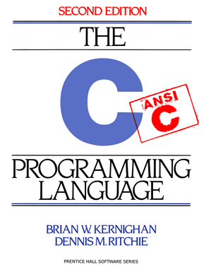

Evoluzione del Linguaggio
=========================

Autori:

*Brian Kernighan*

*Dennis Ritchie*

* AT&T Bell Laboratories, Murray Hill, New Jersey
* Sviluppo a paertire dal 1968
* Concepito come Assembler ad alto livello
* UNIX è stato riscritto in C nel 1971

Sviluppo:

* 1978 - Prima edizione del libro di riferimento del linguaggio
* Anni '80 - sviluppo della *Standard Library* di base
* Anni '80 - sviluppo della *POSIX Library* per i sistemi UNIX
* 1988 - Seconda ed ultima edizione del libro
* 1989 - ANSI C Standard
* 1999 - Revisione del linguaggio: **C99**
* 2011 - Revisione del linguaggio: **C11**

I programmi prodotti sono in codice binario per la piattaforma per cui sono compilati, e sono tipicamente linkati dinamicamente con una libreria principale, che deve essere disponibile a runtime.

Molte implementazioni storiche della libreria, tra cui:

* BSD libc - Berkeley UNIX
* GNU glibc - Linux
* Microsoft C RunTime - Windows
* musl - Alpine Linux, alcuni sistemi embedded
* *proprietarie* - per applicativi speciali e sistemi embedded

Corrispondentemente esistono numerosi compilatori.

I programmi eseguibili possono solo operare sulla piattaforma specifica per cui sono stati compilati e con la libreria specifica per cui sono stati compilati.

Per questo è molto diffusa la consuetudine di fornire gli applicativi come file sorgente (*Open Source*) e poi compilarli sul sistema target.

Se il sistema target è piccolo, embedded, o non dispone di tools di compilazione, è possibile usare un *Cross-Compiler* su un'altra piattaforma.

Note
----

Il compilatore Microsoft di base produce eseguibili solo per il sistema Windows (mondo *chiuso*).

Il compilatore GCC produce eseguibili per qualsiasi sistema compatibile con lo standard POSIX: Unix, Linux, Mac, alcuni RTOS tra cui VxWorks e Integrity (mondo *aperto*).

E' possibile installare GCC in Windows aggiungendo ambienti di supporto alla compilazione POSIX (*free*):

* MinGW
* Cygnus
