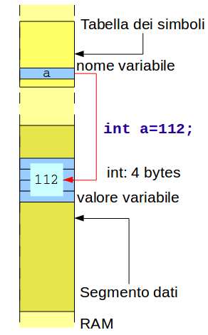

Elementi del Linguaggio
=======================

Tokens, delimitatori, blocchi
-----------------------------

I token sono elementi del linguaggio separati da spazi

* Parole chiave, nomi di variabili, valori,operatori, ecc.

Gli spazi sono delimitatori di token

* blank, tab e newline

Non si possono inserire spazi all'interno di token

I doppi apici delimitano \(racchiudono\) una stringa

Gli spazi sono letterali solo entro stringhe “   “

* Fuori dalle stringhe più spazi valgono come un unico delimitatore

Le graffe racchiudono un blocco di istruzioni

* Dall'esterno il blocco è visto come singola istruzione

Il punto e virgola indica la terminazione dell'istruzione

* Non si mette il punto e virgola dopo le graffe racchiudenti un blocco di istruzioni

Dichiarazioni di variabili
--------------------------

Tutte le variabili devono essere dichiarate prima di essere usate.

Le variabili possono essere inizializzate (ricevere un valore) alla dichiarazione.

Viene riservato spazio in memoria e creato un nome nella tabella dei simboli.

* Lo spazio riservato dipende dal tipo della variabile

Il nome di una variabile:

* contiene solo i caratteri ``A-Za-z0-9_``
* non può contenere spazi

  * usare underscore o 'camel case' (preferita)
  * Es: ``libbre_per_chilo``, ``libbrePerChilo``

* non può iniziare con un numero o underscore
* ha lunghezza massima accettabile 32 caratteri
* fa differenza tra maiuscole e minuscole
* per convenzione inizia con una minuscola
* non può essere una delle parole chiave del linguaggio

Parole chiave del linguaggio
~~~~~~~~~~~~~~~~~~~~~~~~~~~~

Tipi semplici
-------------

Il tipo influenza il modo di trattamento

* tipi interi
* tipi a virgola mobile

Tipi **interi** (1 bit per il segno)

* ``int`` - 4 bytes
* ``char`` - 1 byte

Tipi **float** (caratteristica + mantissa; Standard IEEE 754)

* ``float`` - 4 bytes, precisione: 7 cifre
* ``double`` - 8 bytes, precisione: 15 cifre

Storaggio
~~~~~~~~~

Lo storaggio degli interi dipende dall'architettura:

Modificatori di tipo
--------------------

Di lunghezza:

* ``short int`` - 2 bytes
* ``long int`` - 8 bytes

Di segno \(senza bit di segno\):

* ``unsigned int`` - 4 bytes
* ``unsigned char`` - 1 byte

Combinati:

* ``unsigned short int`` - 2 bytes
* ``unsigned long int`` - 8 bytes

``float`` e ``double`` non hanno modificatori

Range di valori
---------------

Interi:

* ``char`` - da -128 a 127
* ``unsigned char`` - da 0 a 255
* ``short int`` - da -32768 a 32767
* ``unsigned short int`` - da 0 a 65535
* ``int`` - da -2147483648 a 2147483647
* ``unsigned int`` - da 0 a 4294967295
* ``long`` - da -9223372036854775808 a 9223372036854775807
* ``unsigned long`` - da 0 a 18446744073709551615

Virgola mobile:

Assegnazioni
------------

Sintassi:

.. code-block:: c

    nome = valore;

* Il membro sinistro deve essere un nome.
* Il membro destro deve risolversi in un valore dopo l'eventuale valutazione di un'espressione.
  * ``z = (75/a + 50*(18-b));`` **OK** se a e b sono noti
  * ``10 = a;`` **ERRATO**

L'uguale è un operatore di assegnazione

* Il risultato dell'operazione è il valore assegnato

Possibili assegnazioni multiple:

* ``a=b=c=57;`` è equivalente ad ``a=(b=(c=57)));``

Costanti
--------

Una costante è un valore che può essere assegnato ad una variabile o usato in una espressione aritmetica o logica.

Le costanti hanno un tipo:

* ``int`` : 3, 12345678, 750, -100
* ``double`` : 3.14, 6.24E12, -18.345e27
* ``char`` : 'A', 'f', '\n'

Non esiste il tipo stringa ma esiste la costante stringa

* ``char* str1=”Buongiorno”;``

Costanti intere
~~~~~~~~~~~~~~~

Basi numeriche

* Numero inizia con cifra da 1 a 9 : decimale
* Numero inizia con 0 : ottale

  * ``0177`` : 127

* Numero inizia con 0x : esadecimale

  * ``0x5a`` : 132

``long int``:

* suffisso L al numero

  * ``1L`` : numero 1 ma con storaggio a 64 bit
  * ``long value=100L;``

Costanti carattere
~~~~~~~~~~~~~~~~~~
Il carattere c nel codice:

.. code-block:: java

  char c;

  c='A';
  printf(“%d\n”,c);

dà come risultato 65.

Una costante carattere è il carattere racchiuso tra singoli apici

* Viene registrata come il byte corrispondente nel codice US ASCII

  * (Locale 'C' – 7 bit per carattere)

* Problemi di internazionalizzaaione trattati da librerie aggiuntive alla Libreria Standard.
* E' possibile trattarla come un numero con segno di un byte di storaggio.

Costanti carattere speciali
~~~~~~~~~~~~~~~~~~~~~~~~~~~

=========   ===========
Simbolo     Rappresenta
=========   ===========
``\'``      singolo apice
``\”``      doppio apice
``\\``      backslash
``\n``      new line
``\r``      carriage return
``\t``      tab
``\v``      vertical tab
``\f``      form feed
``\0``      null byte (tutti i bit sono zero)
``\0nnn``   carattere ASCII il cui codice ottale è nnn
``\0xnn``   carattere ASCII il cui codice esadecimale è nn
=========   ===========

Perdita di precisione
---------------------

L'assegnazione di un valore eccessivamente grande ad una variabile di storaggio più piccolo porta ad un overflow : troncamento dei bytes più significativi.

* ``unsigned int a=4294967297;`` \(2^32+1\) : a vale 1
* ``char b=258;`` b vale 2
* ``char c=128;`` c vale -1 \(segno\)
* ``unsigned char c=128;`` c vale 128

L'assegnazione di un valore con virgola ad un intero porta a troncamento

* ``float x= 10/3;`` x vale 3.0

**NB**:Non vengono segnalati come errori dal compilatore

Promozione automatica di tipo
-----------------------------

In una operazione avviene una promozione automatica di tipo dell'operando con rappresentazione minore al tipo dell'operando con rappresentazione maggiore.

All'atto dell'assegnazione avviene una trasformazione di tipo.

Cast di tipo
------------

Attenzione:

.. code-block:: c

  float r;
  r=10/3;

``r`` vale 3.0

.. code-block:: c

  r=10.0/3;

``r`` vale 3.333333

Per forzare la conversione esplicita di tipo prima dell'assegnazione si usa l'operatore di cast, di formato:

.. code-block:: c

  (tipo)espressione

Esempio:

.. code-block:: c

  r=(float)10/3;

* ``r`` vale 3.333333

